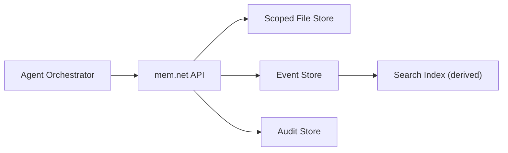
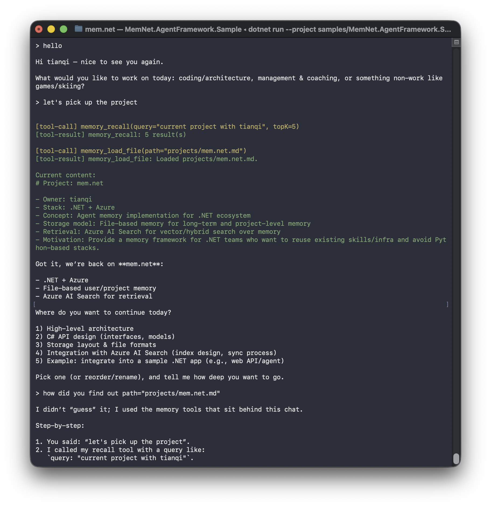

# mem.net

[](https://github.com/TianqiZhang/mem.net/actions/workflows/ci.yml)


File-first memory infrastructure for agents.

`mem.net` provides durable scoped file storage, deterministic context assembly, event recall, and lifecycle cleanup.

## Why mem.net

- Durable memory across sessions and agent restarts.
- Conflict-safe writes with explicit ETag concurrency.
- Deterministic assembly of context files.
- Searchable event digests for recall.
- Backend flexibility: local filesystem or Azure (Blob + AI Search).

## Mental Model

`mem.net` is intentionally simple:

1. Store files for a `(tenant_id, user_id)` scope.
2. Patch or write those files with `If-Match` concurrency.
3. Store event digests separately and search them for recall.
4. Assemble explicit files into context when needed.

Source of truth is file/event/audit storage. Search index is derived state.



## Recommended File Convention

Service routes already scope by tenant/user, so paths can be app-relative.

Recommended default for agent memory:

- `profile.md`
- `long_term_memory.md`
- `projects/{project_name}.md`

Event digests stay in `/events` and are queried through `events:search`.

## Quick Start

### 1) Restore and build

```bash
dotnet restore MemNet.sln --configfile NuGet.Config
dotnet build MemNet.sln -c Debug
```

### 2) Run service (filesystem provider)

```bash
dotnet run --project src/MemNet.MemoryService
```

### 3) Health check

```bash
curl -s http://localhost:5071/
```

Expected response:

```json
{
  "service": "mem.net",
  "status": "ok"
}
```

### 4) Run tests

```bash
dotnet test MemNet.sln -c Debug
```

Optional smoke runner:

```bash
dotnet run --project tests/MemNet.MemoryService.SpecTests -c Debug
```

## API Quick Reference

All APIs are scoped by route:

`/v1/tenants/{tenantId}/users/{userId}/...`

| Method | Route | Purpose |
|---|---|---|
| `GET` | `/v1/tenants/{tenantId}/users/{userId}/files:list` | List files by optional prefix |
| `GET` | `/v1/tenants/{tenantId}/users/{userId}/files/{path}` | Read file |
| `PATCH` | `/v1/tenants/{tenantId}/users/{userId}/files/{path}` | Deterministic patch (`If-Match` required) |
| `PUT` | `/v1/tenants/{tenantId}/users/{userId}/files/{path}` | Replace file (`If-Match` required) |
| `POST` | `/v1/tenants/{tenantId}/users/{userId}/context:assemble` | Assemble explicit file refs |
| `POST` | `/v1/tenants/{tenantId}/users/{userId}/events` | Write event digest |
| `POST` | `/v1/tenants/{tenantId}/users/{userId}/events:search` | Search event digests |
| `POST` | `/v1/tenants/{tenantId}/users/{userId}/retention:apply` | Apply retention |
| `DELETE` | `/v1/tenants/{tenantId}/users/{userId}/memory` | Forget all user memory |

## .NET SDK Quickstart

### Low-level client (`MemNet.Client`)

```csharp
using MemNet.Client;

using var client = new MemNetClient(new MemNetClientOptions
{
    BaseAddress = new Uri("http://localhost:5071"),
    ServiceId = "memory-agent"
});

var scope = new MemNetScope("tenant-demo", "user-demo");

var files = await client.ListFilesAsync(scope, new ListFilesRequest(Prefix: "projects/", Limit: 100));

var assembled = await client.AssembleContextAsync(
    scope,
    new AssembleContextRequest(
        Files:
        [
            new AssembleFileRef("profile.md"),
            new AssembleFileRef("long_term_memory.md")
        ],
        MaxDocs: 4,
        MaxCharsTotal: 40_000));
```

### High-level agent facade (`MemNet.AgentMemory`)

```csharp
using MemNet.AgentMemory;
using MemNet.Client;

using var client = new MemNetClient(new MemNetClientOptions
{
    BaseAddress = new Uri("http://localhost:5071"),
    ServiceId = "memory-agent"
});

var scope = new MemNetScope("tenant-demo", "user-demo");
var memory = new AgentMemory(client, new AgentMemoryPolicy("default", []));

await memory.MemoryWriteFileAsync(
    scope,
    "profile.md",
    "# Profile\n- Name: Tianqi\n- Current Focus: building mem.net\n");

var profile = await memory.MemoryLoadFileAsync(scope, "profile.md");

await memory.MemoryPatchFileAsync(
    scope,
    "profile.md",
    [new MemoryPatchEdit("Current Focus: building mem.net", "Current Focus: shipping mem.net")]);

var recalled = await memory.MemoryRecallAsync(scope, "What is Tianqi building?", topK: 5);
```

The high-level SDK also exposes optional slot/policy helpers, but the primary agent contract is file-like memory tools.

## Migration Guide (slot/policy -> file-like tools)

If you previously modeled memory by slot IDs and template bindings, migrate to direct file primitives.

| Previous style | File-first style |
|---|---|
| `PrepareTurnAsync` with slot defaults | `context:assemble` with explicit `files[]` |
| Slot load by `slot_id` | `memory_load_file(path)` |
| Slot patch with path-template indirection | `memory_patch_file(path, edits)` |
| Slot replace | `memory_write_file(path, content)` |
| Slot/project routing logic in runtime | Caller-owned path conventions + `memory_list_files(prefix)` |

Keep slot/policy helpers only when your app explicitly needs them. They are optional, not the default integration path.

## Official Agent Sample

Runnable sample:

- `samples/MemNet.AgentFramework.Sample`

It demonstrates:

- startup memory prime using `context:assemble`
- restart-safe project discovery using `memory_list_files("projects/")`
- file-like memory tools:
  - `memory_recall(query, topK)`
  - `memory_list_files(prefix, limit)`
  - `memory_load_file(path)`
  - `memory_patch_file(path, old_text, new_text, occurrence)`
  - `memory_write_file(path, content)`
- memory snapshot refresh only after write/patch operations



Run with OpenAI:

```bash
export OPENAI_API_KEY="<your_key>"
export OPENAI_MODEL="gpt-5.1"
export MEMNET_BASE_URL="http://localhost:5071"
export MEMNET_TENANT_ID="tenant-demo"
export MEMNET_USER_ID="user-demo"

dotnet run --project samples/MemNet.AgentFramework.Sample
```

Run with Azure OpenAI:

```bash
export AZURE_OPENAI_ENDPOINT="https://<resource>.cognitiveservices.azure.com"
export AZURE_OPENAI_DEPLOYMENT_NAME="gpt-5.1"
# optional if not using Azure Identity:
# export AZURE_OPENAI_API_KEY="<your_key>"

export MEMNET_BASE_URL="http://localhost:5071"
export MEMNET_TENANT_ID="tenant-demo"
export MEMNET_USER_ID="user-demo"

dotnet run --project samples/MemNet.AgentFramework.Sample
```

## Configuration

### Provider selection

| Variable | Purpose |
|---|---|
| `MEMNET_PROVIDER` | `filesystem` (default) or `azure` |
| `MEMNET_DATA_ROOT` | Filesystem data root |

### Azure provider settings

| Variable | Purpose |
|---|---|
| `MEMNET_AZURE_STORAGE_SERVICE_URI` | Blob service URI |
| `MEMNET_AZURE_DOCUMENTS_CONTAINER` | Documents container |
| `MEMNET_AZURE_EVENTS_CONTAINER` | Events container |
| `MEMNET_AZURE_AUDIT_CONTAINER` | Audit container |
| `MEMNET_AZURE_SEARCH_ENDPOINT` | Optional AI Search endpoint |
| `MEMNET_AZURE_SEARCH_INDEX` | Optional AI Search index |
| `MEMNET_AZURE_SEARCH_SCHEMA_PATH` | Optional bootstrap schema path |

Build with Azure SDK support:

```bash
dotnet build src/MemNet.MemoryService/MemNet.MemoryService.csproj -p:MemNetEnableAzureSdk=true
```

## Azure Bootstrap (Init)

Runtime startup does not create Azure AI Search index schemas.

Use bootstrap tool in deployment:

```bash
dotnet run --project tools/MemNet.Bootstrap -- azure --check
dotnet run --project tools/MemNet.Bootstrap -- azure --apply
```

`--apply` is idempotent and will:

- ensure Blob containers exist
- create or update search index from `infra/search/events-index.schema.json`

## Testing and CI

- CI workflow: `.github/workflows/ci.yml`
- Framework suites: `dotnet test MemNet.sln -c Debug`
- CI publishes TRX and Cobertura artifacts
- CI enforces weighted line-coverage threshold
- Spec runner remains smoke-only for runtime wiring and bootstrap checks

## Repository Guide

- `MEMORY_SERVICE_SPEC.md`: service technical spec (normative contract)
- `SDK_SPEC.md`: SDK technical spec (`MemNet.Client`, `MemNet.AgentMemory`)
- `TASK_BOARD.md`: active execution board
- `docs/archive/TASK_BOARD_ARCHIVE.md`: historical phase log
- `src/MemNet.MemoryService`: service runtime
- `src/MemNet.Client`: low-level .NET SDK
- `src/MemNet.AgentMemory`: high-level agent SDK
- `samples/MemNet.AgentFramework.Sample`: official sample agent

## Contributing

For non-trivial changes:

1. Align behavior with `MEMORY_SERVICE_SPEC.md`.
2. Add or update tests.
3. Update docs and `TASK_BOARD.md`.
