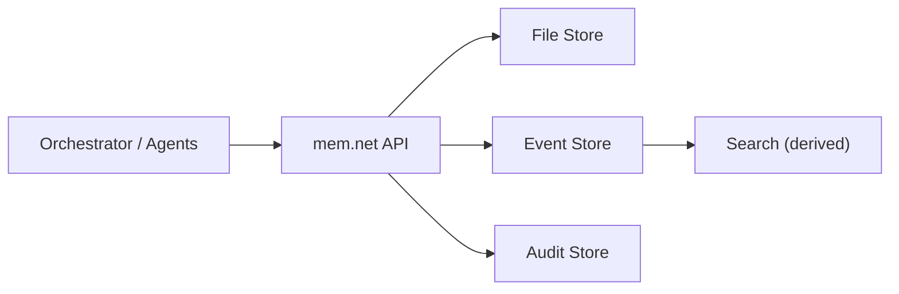

# mem.net

[](https://github.com/TianqiZhang/mem.net/actions/workflows/ci.yml)


Composable memory infrastructure for multi-agent systems.

`mem.net` gives agents a shared, durable memory API with optimistic concurrency, deterministic context assembly, event recall, and lifecycle cleanup.
Application-specific memory semantics (categories, slot rules, schemas) are owned by SDK/application code.

## Why mem.net

- Keep memory durable and auditable across sessions and agents.
- Keep the service generic while letting apps define memory semantics in SDK policy config.
- Preserve conflict-safe writes with ETag optimistic concurrency.
- Keep runtime behavior deterministic with explicit file assembly inputs.

## Core Capabilities

- File read/patch/write with ETag optimistic concurrency.
- Context assembly from explicit file refs with budget controls.
- Event digest write/search.
- Opaque evidence payload support (service stores evidence JSON without app-specific schema coupling).
- Retention and forget-user lifecycle operations.
- Pluggable provider mode:
  - `filesystem` (default local mode)
  - `azure` (Blob + optional AI Search, build-flag gated)

## SDK Policy Pattern

`mem.net` service is generic. Recommended memory categories live in SDK policy config.

- `user/profile.json`
  - key user info
  - optional `projects_index` for caller-side routing
- `user/long_term_memory.json`
  - preferences and durable user facts
- `projects/{project_id}.json`
  - project-specific memory
- event digests
  - write + search across conversations and related services

Typical agent context behavior:
- includes `profile.json` and `long_term_memory.json`
- excludes templated project docs (load them on demand via file APIs)
- event digests are retrieved via `POST /events:search` by the caller

## Architecture



Source of truth is document/event/audit storage. Search is derived and rebuildable.

## Quick Start

### 1) Restore and build

```bash
dotnet restore MemNet.sln --configfile NuGet.Config
dotnet build MemNet.sln -c Debug
```

### 2) Run service (filesystem provider)

```bash
dotnet run --project src/MemNet.MemoryService
```

### 3) Run spec tests

```bash
dotnet tests/MemNet.MemoryService.SpecTests/bin/Debug/net8.0/MemNet.MemoryService.SpecTests.dll
```

### 4) Health check

```bash
curl -s http://localhost:5071/
```

Expected response:

```json
{
  "service": "mem.net",
  "status": "ok"
}
```

## Configuration

Runtime storage/provider behavior is configured via environment variables.

### Key environment variables

| Variable | Purpose |
|---|---|
| `MEMNET_PROVIDER` | `filesystem` or `azure` |
| `MEMNET_DATA_ROOT` | Local data root for filesystem provider |
| `MEMNET_AZURE_STORAGE_SERVICE_URI` | Blob service URI for azure provider |
| `MEMNET_AZURE_DOCUMENTS_CONTAINER` | Documents container |
| `MEMNET_AZURE_EVENTS_CONTAINER` | Events container |
| `MEMNET_AZURE_AUDIT_CONTAINER` | Audit container |
| `MEMNET_AZURE_SEARCH_ENDPOINT` | Optional Azure AI Search endpoint |
| `MEMNET_AZURE_SEARCH_INDEX` | Optional Azure AI Search index |
| `MEMNET_AZURE_SEARCH_SCHEMA_PATH` | Optional schema path for bootstrap tool (default: `infra/search/events-index.schema.json`) |

## Azure Provider

Azure provider code is compiled only when the build flag is enabled.

```bash
dotnet build src/MemNet.MemoryService/MemNet.MemoryService.csproj -p:MemNetEnableAzureSdk=true
```

Run with Azure provider:

```bash
MEMNET_PROVIDER=azure \
MEMNET_AZURE_STORAGE_SERVICE_URI="https://<account>.blob.core.windows.net" \
MEMNET_AZURE_DOCUMENTS_CONTAINER="memnet-documents" \
MEMNET_AZURE_EVENTS_CONTAINER="memnet-events" \
MEMNET_AZURE_AUDIT_CONTAINER="memnet-audit" \
MEMNET_AZURE_SEARCH_ENDPOINT="https://<service>.search.windows.net" \
MEMNET_AZURE_SEARCH_INDEX="<events-index>" \
dotnet run --project src/MemNet.MemoryService -p:MemNetEnableAzureSdk=true
```

If `MEMNET_PROVIDER=azure` is used without Azure SDK build flag, endpoints return `501 AZURE_PROVIDER_NOT_ENABLED`.

## Azure Bootstrap (Init)

`mem.net` runtime does not create Azure AI Search index schemas at startup.

- Blob containers are created lazily on first write.
- Search index provisioning should be done in deployment/bootstrap.

Use the bootstrap tool:

```bash
dotnet run --project tools/MemNet.Bootstrap -- azure --check
dotnet run --project tools/MemNet.Bootstrap -- azure --apply
```

`--apply` performs idempotent initialization:
- ensures Blob containers exist
- creates/updates the configured Azure AI Search index using `infra/search/events-index.schema.json`

Required permissions:
- Blob container management on the target storage account
- Search index management (`Search Service Contributor` role or admin API key)

Recommended deployment order:
1. Deploy infrastructure (Search service, Storage account, identities/roles).
2. Run bootstrap `--apply`.
3. Deploy/start `mem.net` service.

## API Quick Reference

| Method | Route | Purpose |
|---|---|---|
| `GET` | `/v1/tenants/{tenantId}/users/{userId}/files/{path}` | Read file |
| `PATCH` | `/v1/tenants/{tenantId}/users/{userId}/files/{path}` | Patch file (`If-Match` required) |
| `PUT` | `/v1/tenants/{tenantId}/users/{userId}/files/{path}` | Write file (`If-Match` required) |
| `POST` | `/v1/tenants/{tenantId}/users/{userId}/context:assemble` | Assemble explicit file refs |
| `POST` | `/v1/tenants/{tenantId}/users/{userId}/events` | Write event digest |
| `POST` | `/v1/tenants/{tenantId}/users/{userId}/events:search` | Search event digests |
| `POST` | `/v1/tenants/{tenantId}/users/{userId}/retention:apply` | Apply retention (explicit day values) |
| `DELETE` | `/v1/tenants/{tenantId}/users/{userId}/memory` | Forget all user memory |

## SDK Quickstart (.NET)

### Low-level client (`MemNet.Client`)

```csharp
using MemNet.Client;

var client = new MemNetClient(new MemNetClientOptions
{
    BaseAddress = new Uri("http://localhost:5071"),
    ServiceId = "memory-agent"
});

var scope = new MemNetScope("tenant-1", "user-1");
var profileRef = new FileRef("user/profile.json");

var current = await client.GetFileAsync(scope, profileRef);
var updated = await client.PatchFileAsync(
    scope,
    profileRef,
    new PatchDocumentRequest(
        Ops:
        [
            new PatchOperation("add", "/content/projects/-", "mem.net")
        ],
        Reason: "project_update"),
    ifMatch: current.ETag);
```

### High-level agent facade (`MemNet.AgentMemory`)

```csharp
using MemNet.AgentMemory;
using MemNet.Client;

var policy = new AgentMemoryPolicy(
    "memory-agent-default",
    [
        new MemorySlotPolicy("profile", "user/profile.json", null, LoadByDefault: true),
        new MemorySlotPolicy("long_term_memory", "user/long_term_memory.json", null, LoadByDefault: true),
        new MemorySlotPolicy("project", null, "projects/{project_id}.json", LoadByDefault: false)
    ]);

using var client = new MemNetClient(new MemNetClientOptions
{
    BaseAddress = new Uri("http://localhost:5071"),
    ServiceId = "memory-agent"
});

var memory = new AgentMemory(client, policy);
var scope = new MemNetScope("tenant-1", "user-1");

var loaded = await memory.MemoryLoadFileAsync(scope, "user/long_term_memory.md");
var patched = await memory.MemoryPatchFileAsync(
    scope,
    "user/long_term_memory.md",
    [
        new MemoryPatchEdit(
            OldText: "## Preferences\n- concise answers\n",
            NewText: "## Preferences\n- concise answers\n- include tradeoffs first\n")
    ]);
```

## Official Agent Sample (Microsoft Agent Framework)

Runnable reference sample:

- `samples/MemNet.AgentFramework.Sample`

It wires the official 4-tool memory contract directly into a Microsoft Agent Framework agent:

- `memory_recall(query, topK)`
- `memory_load_file(path)`
- `memory_patch_file(path, old_text, new_text, occurrence)`
- `memory_write_file(path, content)`

Run it with OpenAI:

```bash
export OPENAI_API_KEY="<your_key>"
export OPENAI_MODEL="gpt-5.1"
export MEMNET_BASE_URL="http://localhost:5071"
export MEMNET_TENANT_ID="tenant-demo"
export MEMNET_USER_ID="user-demo"

dotnet run --project samples/MemNet.AgentFramework.Sample
```

Or with Azure OpenAI:

```bash
export AZURE_OPENAI_ENDPOINT="https://<resource>.openai.azure.com"
export AZURE_OPENAI_DEPLOYMENT_NAME="gpt-5.1"
# optional if not using Azure Identity:
# export AZURE_OPENAI_API_KEY="<your_key>"

export MEMNET_BASE_URL="http://localhost:5071"
export MEMNET_TENANT_ID="tenant-demo"
export MEMNET_USER_ID="user-demo"

dotnet run --project samples/MemNet.AgentFramework.Sample
```

## Testing and CI

- Local executable spec tests: `tests/MemNet.MemoryService.SpecTests`.
- GitHub Actions workflow: `.github/workflows/ci.yml`.
- CI currently runs:
  - core restore/build/spec tests
  - Azure SDK-enabled restore/build/spec tests

## Repository Map

- `MEMORY_SERVICE_SPEC.md` - technical spec aligned with current implementation.
- `SDK_SPEC.md` - SDK technical spec for `MemNet.Client` and `MemNet.AgentMemory`.
- `src/MemNet.MemoryService/Api` - HTTP entrypoint and endpoint wiring.
- `src/MemNet.MemoryService/Application` - orchestration services (`MemoryCoordinator`, lifecycle, replay).
- `src/MemNet.MemoryService/Domain` - core models, errors, and patch engine.
- `src/MemNet.MemoryService/Backends` - store abstractions and provider implementations.
- `src/MemNet.Client` - low-level .NET SDK for mem.net endpoints.
- `src/MemNet.AgentMemory` - high-level agent memory SDK facade.
- `samples/MemNet.AgentFramework.Sample` - official Microsoft Agent Framework + mem.net sample.
- `tools/MemNet.Bootstrap` - deployment/bootstrap tool for Azure containers and AI Search index.
- `infra/search/events-index.schema.json` - source-controlled schema for event search index.
- `tests/MemNet.MemoryService.SpecTests` - executable specification tests.
- `TASK_BOARD.md` - implementation progress and backlog.
- `AGENTS.md` - development guardrails and first-principles rules.

## Roadmap (Short)

- Provider-agnostic contract tests.
- Background replay/reindex orchestration.
- Optional compaction worker with dedicated config.

## Contributing

PRs are welcome. For non-trivial changes, align proposals with `MEMORY_SERVICE_SPEC.md` and keep behavior covered by spec tests.
