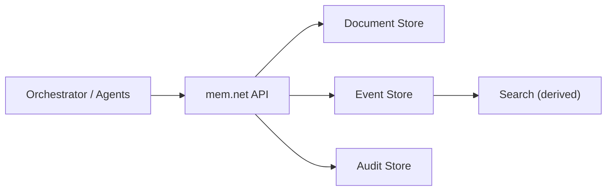

# mem.net

[](https://github.com/TianqiZhang/mem.net/actions/workflows/ci.yml)


Policy-driven memory service for multi-agent systems.

`mem.net` gives agents a shared, durable memory API with strict write guardrails, optimistic concurrency, deterministic context assembly, and lifecycle cleanup.

## Why mem.net

- Keep memory durable and auditable across sessions and agents.
- Avoid hard-coded memory categories by using `policy.json`.
- Prevent unsafe writes with binding-level path and size constraints.
- Keep runtime behavior predictable with ETag concurrency and deterministic assembly.

## Core Capabilities (v1)

- Document read/patch/replace with ETag optimistic concurrency.
- Context assembly for deterministic base memory with budget controls.
- Event digest write/search.
- Retention and forget-user lifecycle operations.
- Pluggable provider mode:
  - `filesystem` (default local mode)
  - `azure` (Blob + optional AI Search, build-flag gated)

## Default Starter Policy

The default `policy.json` models a practical learn-companion memory shape:

- `user/profile.json`
  - key user info
  - optional `projects_index` for caller-side routing
- `user/long_term_memory.json`
  - preferences and durable user facts
- `projects/{project_id}.json`
  - project-specific memory
- event digests
  - write + search across conversations and related services

Context assembly default behavior:
- includes `profile.json` and `long_term_memory.json`
- excludes templated project docs (load them on demand via document APIs)
- event digests are retrieved via `POST /events:search` by the caller

## Architecture



Source of truth is document/event/audit storage. Search is derived and rebuildable.

## Quick Start

### 1) Restore and build

```bash
dotnet restore MemNet.sln --configfile NuGet.Config
dotnet build MemNet.sln -c Debug
```

### 2) Run service (filesystem provider)

```bash
dotnet run --project src/MemNet.MemoryService
```

### 3) Run spec tests

```bash
dotnet tests/MemNet.MemoryService.SpecTests/bin/Debug/net8.0/MemNet.MemoryService.SpecTests.dll
```

### 4) Health check

```bash
curl -s http://localhost:5071/
```

Expected response:

```json
{
  "service": "mem.net",
  "status": "ok"
}
```

## Configuration

Runtime behavior is driven by `src/MemNet.MemoryService/Policy/policy.json`.

### Key environment variables

| Variable | Purpose |
|---|---|
| `MEMNET_PROVIDER` | `filesystem` or `azure` |
| `MEMNET_DATA_ROOT` | Local data root for filesystem provider |
| `MEMNET_CONFIG_ROOT` | Policy root directory (contains `policy.json`) |
| `MEMNET_AZURE_STORAGE_SERVICE_URI` | Blob service URI for azure provider |
| `MEMNET_AZURE_DOCUMENTS_CONTAINER` | Documents container |
| `MEMNET_AZURE_EVENTS_CONTAINER` | Events container |
| `MEMNET_AZURE_AUDIT_CONTAINER` | Audit container |
| `MEMNET_AZURE_SEARCH_ENDPOINT` | Optional Azure AI Search endpoint |
| `MEMNET_AZURE_SEARCH_INDEX` | Optional Azure AI Search index |

## Azure Provider

Azure provider code is compiled only when the build flag is enabled.

```bash
dotnet build src/MemNet.MemoryService/MemNet.MemoryService.csproj -p:MemNetEnableAzureSdk=true
```

Run with Azure provider:

```bash
MEMNET_PROVIDER=azure \
MEMNET_AZURE_STORAGE_SERVICE_URI="https://<account>.blob.core.windows.net" \
MEMNET_AZURE_DOCUMENTS_CONTAINER="memnet-documents" \
MEMNET_AZURE_EVENTS_CONTAINER="memnet-events" \
MEMNET_AZURE_AUDIT_CONTAINER="memnet-audit" \
MEMNET_AZURE_SEARCH_ENDPOINT="https://<service>.search.windows.net" \
MEMNET_AZURE_SEARCH_INDEX="<events-index>" \
dotnet run --project src/MemNet.MemoryService -p:MemNetEnableAzureSdk=true
```

If `MEMNET_PROVIDER=azure` is used without Azure SDK build flag, endpoints return `501 AZURE_PROVIDER_NOT_ENABLED`.

## API Quick Reference

| Method | Route | Purpose |
|---|---|---|
| `GET` | `/v1/tenants/{tenantId}/users/{userId}/documents/{namespace}/{path}` | Read document |
| `PATCH` | `/v1/tenants/{tenantId}/users/{userId}/documents/{namespace}/{path}` | Patch document (`If-Match` required) |
| `PUT` | `/v1/tenants/{tenantId}/users/{userId}/documents/{namespace}/{path}` | Replace document (restricted by `write_mode`) |
| `POST` | `/v1/tenants/{tenantId}/users/{userId}/context:assemble` | Assemble runtime memory context |
| `POST` | `/v1/tenants/{tenantId}/users/{userId}/events` | Write event digest |
| `POST` | `/v1/tenants/{tenantId}/users/{userId}/events:search` | Search event digests |
| `POST` | `/v1/tenants/{tenantId}/users/{userId}/retention:apply` | Apply retention (`policy_id`) |
| `DELETE` | `/v1/tenants/{tenantId}/users/{userId}/memory` | Forget all user memory |

## Testing and CI

- Local executable spec tests: `tests/MemNet.MemoryService.SpecTests`.
- GitHub Actions workflow: `.github/workflows/ci.yml`.
- CI currently runs:
  - core restore/build/spec tests
  - Azure SDK-enabled restore/build/spec tests

## Repository Map

- `MEMORY_SERVICE_SPEC.md` - technical spec aligned with current implementation.
- `src/MemNet.MemoryService/Api` - HTTP entrypoint and endpoint wiring.
- `src/MemNet.MemoryService/Application` - orchestration services (`MemoryCoordinator`, lifecycle, replay).
- `src/MemNet.MemoryService/Domain` - core models, errors, and patch engine.
- `src/MemNet.MemoryService/Policy` - `PolicyRegistry` and default `policy.json`.
- `src/MemNet.MemoryService/Backends` - store abstractions and provider implementations.
- `tests/MemNet.MemoryService.SpecTests` - executable specification tests.
- `TASK_BOARD.md` - implementation progress and backlog.
- `AGENTS.md` - development guardrails and first-principles rules.

## Roadmap (Short)

- Provider-agnostic contract tests.
- Background replay/reindex orchestration.
- Optional compaction worker with dedicated config.

## Contributing

PRs are welcome. For non-trivial changes, align proposals with `MEMORY_SERVICE_SPEC.md` and keep behavior covered by spec tests.
